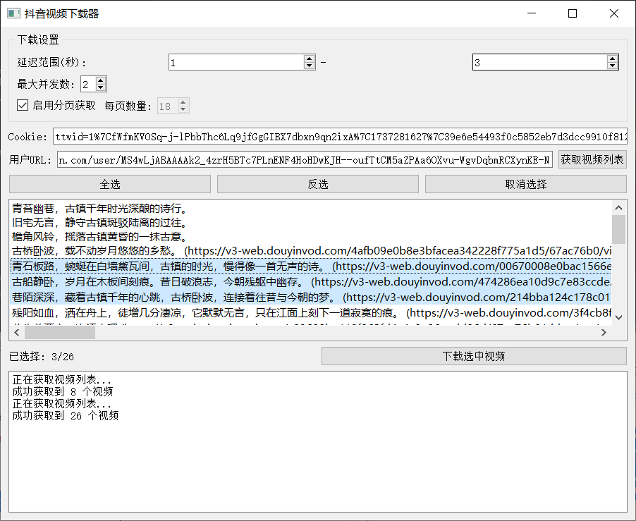
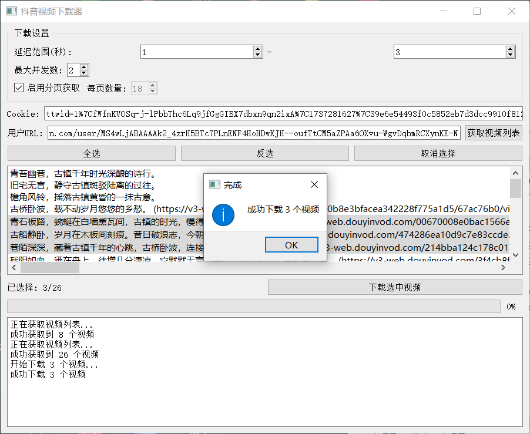
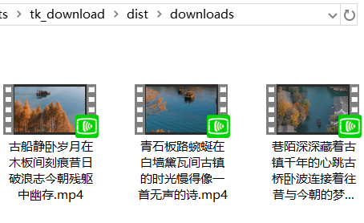

# 抖音视频下载器 (Douyin Video Downloader)（已失效，抖音接口更新了）

一个用于下载抖音用户视频的Python工具，支持GUI界面操作和命令行使用。

## 功能特点

- 支持通过用户主页URL批量下载视频
- 提供图形用户界面(GUI)和命令行两种使用方式
- 支持多线程并发下载
- 可配置下载延迟，避免请求过于频繁
- 支持分页获取完整视频列表
- 视频文件自动使用视频描述命名
- 支持选择性下载指定视频

## 安装要求

- Python 3.6+
- 依赖包:
  - requests
  - PyQt5 (仅GUI模式需要)

安装依赖:
```bash
pip install requests PyQt5
```

## 使用方法

### GUI模式

运行以下命令启动图形界面:

```bash
python douyin_gui.py
```

GUI界面功能:
1. 设置下载参数（延迟范围、并发数、分页等）
2. 输入Cookie和用户URL
3. 获取视频列表
4. 选择要下载的视频
5. 开始批量下载

### 截图







### 命令行模式

```python
from douyin_downloader import DouyinDownloader

# 创建下载器实例
downloader = DouyinDownloader(
    delay_range=(1, 5),  # 延迟1-5秒
    max_workers=3        # 最多3个并发下载
)

# 设置用户URL
user_url = "https://www.douyin.com/user/[用户ID]"

# 获取视频列表
videos = downloader.get_video_list(user_url)

# 下载视频
downloaded_files = downloader.batch_download(videos)
```

## 配置说明

1. 延迟设置
   - 可设置请求间隔的随机延迟范围
   - 建议设置1-5秒以避免请求过于频繁

2. 并发设置
   - 控制同时下载的视频数量
   - 建议设置3-5个并发数

3. Cookie设置
   - 需要设置有效的抖音Cookie
   - 可从浏览器开发者工具中获取

## 注意事项

1. 使用前请确保遵守抖音的使用条款
2. 下载内容仅供个人学习使用
3. 避免过于频繁的请求
4. 请勿用于商业用途
5. 建议使用代理IP，避免被封禁

## 常见问题

1. 无法获取视频列表
   - 检查Cookie是否有效
   - 确认用户URL格式正确
   - 检查网络连接

2. 下载失败
   - 检查网络连接
   - 确认存储空间充足
   - 查看是否触发反爬限制

## 免责声明

1.本工具仅用于学习和研究目的，使用本工具产生的任何后果由使用者自行承担。请遵守相关法律法规和平台规则。

2.如有侵权行为请联系我删除仓库。

## License

MIT License
